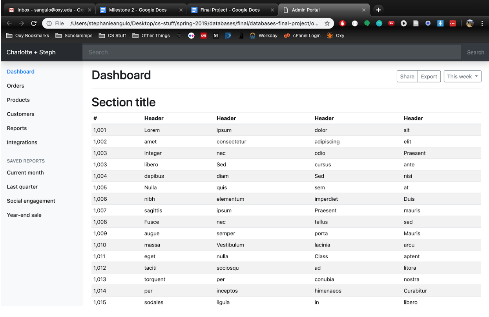

### Progress to date
So far, we have finished inserting all the data to the specified entity and relationship tables shown below in our update E/R diagram –

*Relationship Tables: Diagnoses, GetsPatientFrom, Has, Prescribes, SendsPatientTo.
Entity Tables: Diagnosis, Discharge, Encounter, Medication, Patient, Physician, Source, Vitals.*

When going through the process of attempting to add the data to the tables, we realized that some of the schemas had to be updated, i.e. changing the type from an int to a varchar because some ids contain non-numeric characters in them. Along with that, though we get most of our data from the University of Michigan site, we had to outsource another csv file to get the correct mappings of ICD 9 codes to the description for our Diagnosis entity. We ran into some problems correctly mapping the ICD 9 codes from the diabetic patients’ dataset to the github dataset that holds ICD 9 codes and their descriptions – for example, the ICD 9 code for a patient’s diagnosis could be “V08.0”, but on the GitHub dataset the closest ICD 9 code to that could be “V08”, which clearly do not equal each other when we run a string comparison with each other. Due to that, we had to create a “ICD 9 code clean up” function.

### Platform
We started working on the front end code for this project as well. We grabbed a dashboard template from bootstrap, using their HTML and CSS. We began writing PHP scripts to query our dataset, however we found PHP too verbose and decided to take a different route. Stephanie briefly looked into React web apps and Node.js for the mysql connection. Launching a react app took way too long (20 seconds or so) and the learning curve was unrealistic for the amount of time left for this project. We decided to use Django, a Python web framework, to manage our web related needs. Django will facilitate the mysql connection to the HTML files. Here is an example of what the main HTML web page currently looks like.

### New Assumptions
Not many new assumptions were made, however we did realize that when inserting new rows into our tables, having default values other than NULL are useful. For example, when inserting a new patient, there are four attributes: patient_id, race, gender, and payer_code. The payer_code attribute has datatype ENUM with the possibility for “?” as a payer code. Thus, instead of having entries with NULL and “?” for the payer_code, the default value will be “?” to fit with the current schema. Similar default assumptions were made for source_id, discharge_id, and admiss_type.

### Future Steps
Our following actions would be:
- Use Python and Django to access our database locally and create queries based on the parameters the user passes in through our front end (whether that be strings from the search engine, radio buttons, or drop down menus).
- Use numpy and other Python libraries to help give us meaningful insight to the data to pass back to the front end.
- Add D3.js to our front end for data visualization, i.e. graphs and charts.
Use jQuery to update the HTML tags, specifically the table shown on the screenshot.
